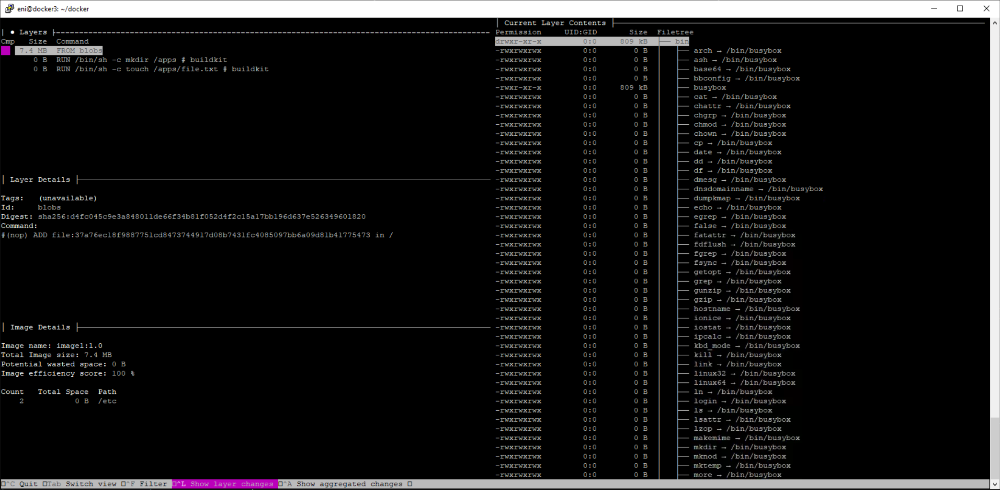

# Write a first Dockerfile

Write a first Dockerfile and observe what happens. Using the Dive tool, find out how many layers the resulting image consists of

---

## the work to be done

Based on alpine image, create a new image. In the folder /apps an empty text file is present as "file.txt"

## The result

### Generate the container
<em>docker build -t "image1:1.0" .</em>

### Check that the work has been carried out correctly
* start the container in iteractiv mode <em> docker run -it image1:1.0</em>
* navigate to the <em>/app</em> folder and check for the <em>file.txt</em> file

### Using a Dive container, observe the number of layser in the image created.
* <em>docker run --rm -it -v /var/run/docker.sock:/var/run/docker.sock wagoodman/dive:latest image1:1.0</em>

You'll see that the image created is made up of three containers. The first is the alpine base image, then the Dockerfile creates a layer for each command executed

